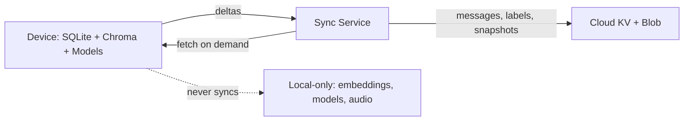

# System Design: On-Device Storage and Sync

This is the storage and sync model that sits underneath Parts 1–3. The constraint is that the system has to work offline first and treat the network as something that may or may not be there, with the user's content kept on the device by default.

## Storage

Two stores on each device. SQLite holds the structured rows: messages, intent labels, daily persona snapshots, and user prefs. Chroma sits next to it as a persistent directory of vector embeddings. The embeddings are derived data — if the file is lost or corrupted, it can be rebuilt from the message log.

Encryption is on by default. The SQLite database is wrapped with SQLCipher; the key lives in the platform keychain (Keychain on macOS, DPAPI on Windows, libsecret on Linux). The Chroma directory sits inside an OS-level encrypted container (FileVault, BitLocker, or LUKS) so the vector store inherits the same protection without us reimplementing it.

## Sync boundary

What goes to the server:

- Messages, append-only and treated as immutable once written.
- Intent labels, each tagged with the model hash that produced them.
- Daily persona snapshots from Part 1.
- User prefs.

What stays on the device:

- Embedding vectors and the Chroma index. They're large, they're reproducible from the messages, and raw vectors leak content under known inversion attacks. No reason to ship them.
- Model files (the intent classifier, MiniLM, the NLI cross-encoder). Static artifacts that don't need per-device sync — the install pipeline handles them.
- UI state, drafts, audio buffers, anything ephemeral.

The split is about three things: bandwidth, privacy, and provenance. Embeddings are large and reproducible. Vectors can leak the message content they encoded. Model binaries are the same on every device, so there's nothing to merge.

## Conflict resolution

Messages don't conflict. They're an append-only log, and the server orders them by `client_timestamp` with a device-id tie-breaker. If two devices write at the same instant, both messages land — neither is dropped.

Persona snapshots use per-field vector clocks. Last-writer-wins on each field, but the full prior snapshot is kept for audit so a user can see how their daily persona moved over time. This is low-contention by design: snapshots are recomputed on a schedule, not edited live.

Intent labels carry a model version. If the server sees a label from an older model, it recomputes; if it matches, it accepts. This stops stale labels from quietly degrading the dataset when a model is upgraded.

Contradictions surfaced by the Part 3 RAG resolver are never auto-resolved. They're shown to the user, attached to the chunks they came from. The system can detect inconsistency; deciding what is true is the user's job.

## Pros and cons

| Pros | Cons |
|------|------|
| Works offline; the network is optional | Cold sync on a fresh device is expensive — every message has to come down |
| Vectors and audio never leave the device | No real-time multi-device editing; this is store-and-forward, not live collab |
| Sync payloads are small: deltas and structured rows only | Index drift if devices end up on different model versions before a rebuild fires |
| Conflict rules are deterministic and inspectable | Last-writer-wins on persona fields can silently drop a concurrent edit |

## Diagram

The dotted edge is the privacy boundary. Everything to the right of it stays on the device for the lifetime of the install. If `mmdc` is on the path, `docs/diagram.png` is the rendered fallback for viewers that don't render mermaid; otherwise the inline block above is the source of truth.
